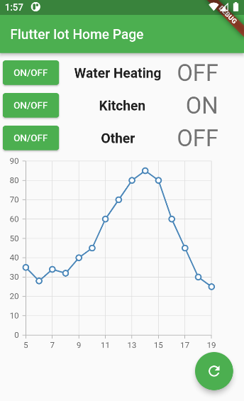

# Overview

This project has three main targets:
* FIRST: Control the electricity inside my home using my mobile from anywhere.
* SECOND: Automating the solar system output according to the sunlight intensity.
* THIRD: Interfacing the solar inverter data on a mobile application.

## First target
Done, using Firebase realtime database with flutter UI, ESP8266 and three ralay modules.

## Second target
To be done later, using BH1750 light intensity sensor.

## Third target
To be done later, using ENC28J60 ethernet module to sniff data from solar inverter using LAN communication.

## UI

* I'm using the three ON/OFF buttons to control the relay modules.
* The floating green button on the bottom right is to check the state of each relay by getting data from the ESP8266 through firebase and then refresh the app.
* The chart will be showing the realtime data of sunlight intensity from 5:00 AM to 7:00 PM.